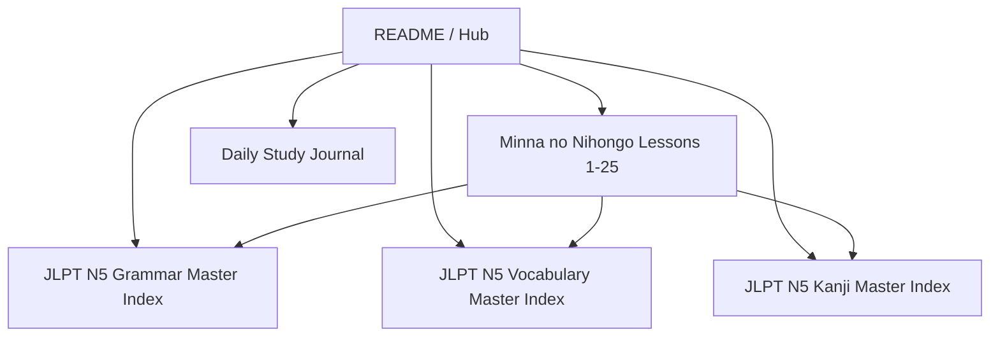

# 🇯🇵 Japanese Study Knowledge Base — JLPT N5 & Minna no Nihongo (မြန်မာဘာသာဖြင့် ဂျပန်စာ လေ့လာရန်)

Welcome to your **Foam Personal Knowledge Base** tailored for learning **JLPT N5** using **Minna no Nihongo Shokyu I (みんなの日本語 初級I)** with **Burmese (မြန်မာဘာသာ)** translations and grammar comparisons!

> 💡 **Burmese Learner Note**: Japanese and Burmese share the same **Subject - Object - Verb (SOV)** word order and particle system (`は` = `က/ဟာ`, `です` = `ဖြစ်ပါတယ်`, `の` = `ရဲ့`, `か` = `လား`)!

---

## 🚀 Quick Navigation Hub

| Section | Description | Direct Link |
| :--- | :--- | :--- |
| 📘 **Textbook Lessons** | Minna no Nihongo I (第1課 〜 第25課) | [[minna-no-nihongo/index]] |
| 📐 **Grammar Bank** | N5 Grammar Patterns & Particles (မြန်မာသဒ္ဒါ နှိုင်းယှဉ်ချက်) | [[grammar/index]] |
| 🔤 **Vocabulary Bank** | Categorized Vocab Hubs (Occupations, Demonstratives, Verbs) | [[vocabulary/index]] |
| 🈁 **Kanji Bank** | ~100 Essential N5 Characters (ခန်ဂျီ) | [[kanji/index]] |
| 🗓️ **Study Journal** | Daily Study Logs & Progress Tracking | [[journal/2026-07-23]] |

---

## 📖 Minna no Nihongo Shokyu I Progress (Lessons 1-25)

- [x] [[minna-no-nihongo/lesson-01|第1課 Lesson 01]] — Self-Introductions (`~は~です`, `~ではありません`, `~ですか`)
- [x] [[minna-no-nihongo/lesson-02|第2課 Lesson 02]] — Demonstratives (`これ/それ/あれ`, `この/その/あの`)
- [ ] [[minna-no-nihongo/lesson-03|第3課 Lesson 03]] — Locations & Directions (`ここ/そこ/あそこ`, `こちら/そちら/あちら`)
- [ ] [[minna-no-nihongo/lesson-04|第4課 Lesson 04]] — Time, Daily Routines & Verb Forms (`~時~分`, `ます/ません/ました`)
- [ ] [[minna-no-nihongo/lesson-05|第5課 Lesson 05]] — Movement & Transport (`へ行きます/来ます/帰ります`, `で`, `と`)
- [ ] [[minna-no-nihongo/lesson-06|第6課 Lesson 06]] — Direct Objects & Actions (`を`, `で`, `〜をしませんか`, `〜ましょう`)
- [ ] [[minna-no-nihongo/lesson-07|第7課 Lesson 07]] — Instruments & Giving/Receiving (`で`, `に〜をあげます/もらいます`)
- [ ] [[minna-no-nihongo/lesson-08|第8課 Lesson 08]] — Adjectives (`い-adjectives`, `な-adjectives`, `〜ですが`)
- [ ] [[minna-no-nihongo/lesson-09|第9課 Lesson 09]] — Likes, Dislikes & Abilities (`〜が好きです/嫌いです`, `〜がわかります`, `〜があります`)
- [ ] [[minna-no-nihongo/lesson-10|第10課 Lesson 10]] — Existence of People & Objects (`〜に〜があります/います`)
- [ ] [[minna-no-nihongo/lesson-11|第11課 Lesson 11]] — Counting & Quantifiers (Counters, Duration)
- [ ] [[minna-no-nihongo/lesson-12|第12課 Lesson 12]] — Past Tense Adjectives & Comparisons (`〜より〜のほうが`, `〜で〜が一番`)
- [ ] [[minna-no-nihongo/lesson-13|第13課 Lesson 13]] — Desires & Intentions (`〜が欲しいです`, `〜たいです`, `〜へ行きます`)
- [ ] [[minna-no-nihongo/lesson-14|第14課 Lesson 14]] — Verb て-form (Group 1, 2, 3) & Requests (`〜てください`, `〜ています`)
- [ ] [[minna-no-nihongo/lesson-15|第15課 Lesson 15]] — Permission & Prohibition (`〜てもいいです`, `〜てはいけません`)
- [ ] [[minna-no-nihongo/lesson-16|第16課 Lesson 16]] — Connecting Actions (`て-form` sequence, `〜てから`, `〜は〜が`)
- [ ] [[minna-no-nihongo/lesson-17|第17課 Lesson 17]] — Verb ない-form & Obligations (`〜ないでください`, `〜なければなりません`)
- [ ] [[minna-no-nihongo/lesson-18|第18課 Lesson 18]] — Dictionary Form & Potential (`〜辞書形`, `〜ことができます`, `趣味は〜ことです`)
- [ ] [[minna-no-nihongo/lesson-19|第19課 Lesson 19]] — Verb た-form & Experiences (`〜たことがあります`, `〜たり〜たりします`)
- [ ] [[minna-no-nihongo/lesson-20|第20課 Lesson 20]] — Casual Speech (Plain style vs. Polite style)
- [ ] [[minna-no-nihongo/lesson-21|第21課 Lesson 21]] — Thoughts & Quotations (`普通形＋と思います`, `〜と言いました`)
- [ ] [[minna-no-nihongo/lesson-22|第22課 Lesson 22]] — Noun Modification Clauses (`[Clause] + Noun`)
- [ ] [[minna-no-nihongo/lesson-23|第23課 Lesson 23]] — Time & Condition (`〜とき`, `〜と、〜`)
- [ ] [[minna-no-nihongo/lesson-24|第24課 Lesson 24]] — Giving & Receiving Actions (`〜てあげます`, `〜てもらいます`, `〜てくれます`)
- [ ] [[minna-no-nihongo/lesson-25|第25課 Lesson 25]] — Conditional Forms (`〜たら`, `〜ても`)

---

## 🛠️ How to Use Foam in VS Code

1. **Follow [[wiki-links]]**: Hold `Ctrl` (or `Cmd`) and click on any `[[wiki-link]]` to jump directly to that note.
2. **Foam Graph Visualization**: Open VS Code Command Palette (`Ctrl+Shift+P`), type `Foam: Show Graph`.
3. **Note Creation from Templates**: Use templates from `templates/` for Lesson, Grammar, Vocabulary, and Kanji notes.
